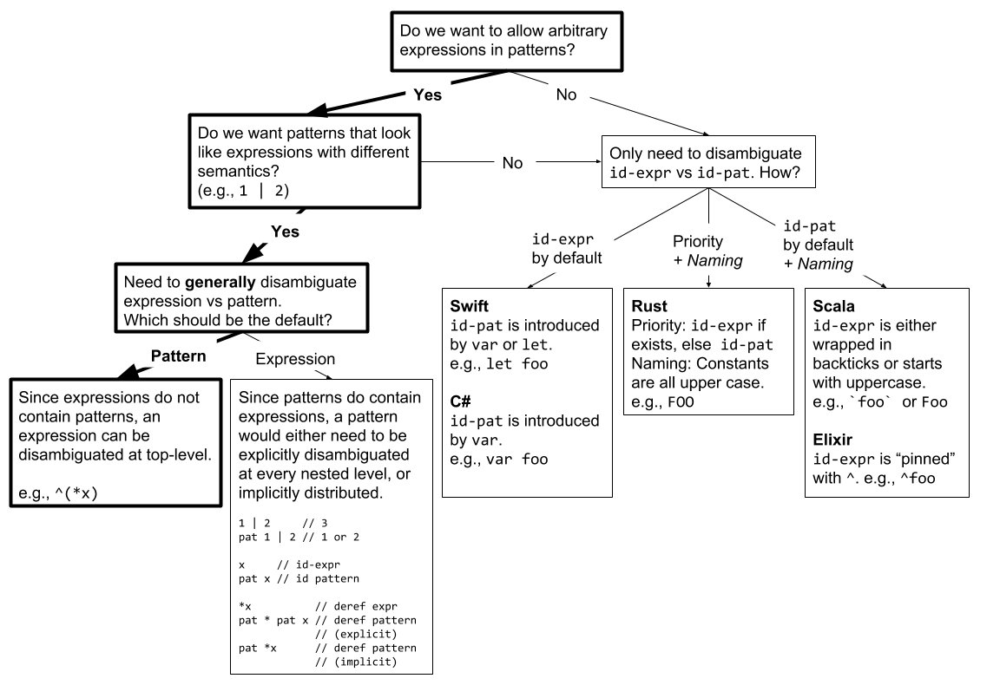

\pagebreak

# Revision History

  - R0 --- Merged [@P1260R0] and [@P1308R0]

# Introduction

As algebraic data types gain better support in C++ with facilities such as
`tuple` and `variant`, the importance of mechanisms to interact with them have
increased. While mechanisms such as `apply` and `visit` have been added, their
usage is quite complex and limited even for simple cases. Pattern matching is
a widely adopted mechanism across many programming languages to interact with
algebraic data types that can help greatly simplify C++. Examples of programming
languages include text-based languages such as SNOBOL back in the 1960s,
functional languages such as Haskell and OCaml, and "mainstream" languages such
as Scala, Swift, and Rust.

This paper is a result of collaboration between the authors of [@P1260R0] and
[@P1308R0]. A joint presentation by the authors of the two proposals was given
in EWGI at the San Diego 2018 meeting, with the closing poll:
"Should we commit additional committee time to pattern matching?" ---
SF: 14, WF: 0, N: 1, WA: 0, SA: 0

# Motivation and Scope

Virtually every program involves branching on some predicates applied to a value
and conditionally binding names to some of its components for use in subsequent
logic. Today, C++ provides two types of selection statements: the `if` statement
and the `switch` statement.

Since `switch` statements can only operate on a _single_ integral value and
`if` statements operate on an _arbitrarily_ complex boolean expression, there is
a significant gap between the two constructs even in inspection of
the "vocabulary types" provided by the standard library.

In C++17, structured binding declarations [@P0144R2] introduced the ability to
concisely bind names to components of `tuple`-like values. The proposed
direction of this paper aims to naturally extend this notion by performing
__structured inspection__  with `inspect` statements and expressions. The
goal of `inspect` is to bridge the gap between `switch` and `if` statements
with a __declarative__, __structured__, __cohesive__, and __composable__
mechanism.

# Before/After Comparisons

## Matching Integrals

::: tonytable

### Before
```cpp
switch (x) {
  case 0: std::cout << "got zero"; break;
  case 1: std::cout << "got one"; break;
  default: std::cout << "don't care";
}
```

### After
```cpp
inspect (x) {
  0: std::cout << "got zero";
  1: std::cout << "got one";
  _: std::cout << "don't care";
}
```

:::

## Matching Strings

::: tonytable

### Before
```cpp
if (s == "foo") {
  std::cout << "got foo";
} else if (s == "bar") {
  std::cout << "got bar";
} else {
  std::cout << "don't care";
}
```

### After
```cpp
inspect (s) {
  "foo": std::cout << "got foo";
  "bar": std::cout << "got bar";
  _: std::cout << "don't care";
}
```

:::

## Matching Tuples

::: tonytable

### Before
```cpp
auto&& [x, y] = p;
if (x == 0 && y == 0) {
  std::cout << "on origin";
} else if (x == 0) {
  std::cout << "on y-axis";
} else if (y == 0) {
  std::cout << "on x-axis";
} else {
  std::cout << x << ',' << y;
}
```

### After
```cpp
inspect (p) {
  [0, 0]: std::cout << "on origin";
  [0, y]: std::cout << "on y-axis";
  [x, 0]: std::cout << "on x-axis";
  [x, y]: std::cout << x << ',' << y;
}
```

:::

## Matching Variants

::: tonytable

### Before
```cpp
struct visitor {
  void operator()(int i) const {
    os << "got int: " << i;
  }
  void operator()(float f) const {
    os << "got float: " << f;
  }
  std::ostream& os;
};
std::visit(visitor{strm}, v);
```

### After
```cpp
inspect (v) {
  <int> i: strm << "got int: " << i;
  <float> f: strm << "got float: " << f;
}
```

:::

## Matching Polymorphic Types

```cpp
struct Shape { virtual ~Shape() = default; };
struct Circle : Shape { int radius; };
struct Rectangle : Shape { int width, height; };
```

::: tonytable

### Before
```cpp
virtual int Shape::get_area() const = 0;

int Circle::get_area() const override {
  return 3.14 * radius * radius;
}
int Rectangle::get_area() const override {
  return width * height;
}
```

### After
```cpp
int get_area(const Shape& shape) {
  return inspect (shape) {
    <Circle>    [r]    => 3.14 * r * r,
    <Rectangle> [w, h] => w * h
  }
}
```

:::

## Evaluating Expression Trees

```cpp
struct Expr;

struct Neg {
  std::shared_ptr<Expr> expr;
};

struct Add {
  std::shared_ptr<Expr> lhs, rhs;
};

struct Mul {
  std::shared_ptr<Expr> lhs, rhs;
};

struct Expr : std::variant<int, Neg, Add, Mul> {
  using variant::variant;
};

namespace std {
  template <>
  struct variant_size<Expr> : variant_size<Expr::variant> {};

  template <std::size_t I>
  struct variant_alternative<I, Expr> : variant_alternative<I, Expr::variant> {};
}
```

\pagebreak

::: tonytable

### Before
```cpp
int eval(const Expr& expr) {
  struct visitor {
    int operator()(int i) const {
      return i;
    }
    int operator()(const Neg& n) const {
      return -eval(*n.expr);
    }
    int operator()(const Add& a) const {
      return eval(*a.lhs) + eval(*a.rhs);
    }
    int operator()(const Mul& m) const {
      // Optimize multiplication by 0.
      if (int* i = std::get_if<int>(m.lhs.get()); i && *i == 0) {
        return 0;
      }
      if (int* i = std::get_if<int>(m.rhs.get()); i && *i == 0) {
        return 0;
      }
      return eval(*m.lhs) * eval(*m.rhs);
    }
  };
  return std::visit(visitor{}, expr);
}
```

---

### After
```cpp
int eval(const Expr& expr) {
  inspect (expr) {
    <int> i: return i;
    <Neg> [*e]: return -eval(e);
    <Add> [*l, *r]: return eval(l) + eval(r);
    // Optimize multiplication by 0.
    <Mul> [*(<int> 0), _]: return 0;
    <Mul> [_, *(<int> 0)]: return 0;
    <Mul> [*l, *r]: return eval(l) * eval(r);
  }
}
```

:::

\pagebreak

# Design Overview

## Basic Syntax

There are two forms of `inspect`: the statement form and the expression form.

> | `inspect constexpr`_~opt~_ `(` _init-statement~opt~_ _condition_ `) {`
> |     _pattern_ _guard~opt~_ `:` _statement_
> |     _pattern_ _guard~opt~_ `:` _statement_
> |     ...
> | `}`

> | `inspect constexpr`_~opt~_ `(` _init-statement~opt~_ _condition_ `)` _trailing-return-type~opt~_ `{`
> |     _pattern_ _guard~opt~_ `=>` _expression_ `,`
> |     _pattern_ _guard~opt~_ `=>` _expression_ `,`
> |     ...
> | `}`

> | _guard:_
> |     `if (` _expression_ `)`

::: note
The expression form is roughly equivalent to:

> | `std::invoke([&]()` _trailing-return-type~opt~_ `{`
> |     `inspect constexpr`_~opt~_ `(` _init-statement~opt~_ _condition_ `) {`
> |          _pattern_ _guard~opt~_ `: return` _expression_ `;`
> |          _pattern_ _guard~opt~_ `: return` _expression_ `;`
> |          ...
> |     `}`
> | `})`
:::

## Basic Model

Within the parentheses, the `inspect` statement is equivalent to `switch` and
`if` statements except that no conversion nor promotion takes place in
evaluating the value of its condition.

When the `inspect` statement is executed, its condition is evaluated and matched
in order (first match semantics) against each pattern. If a pattern successfully
matches the value of the condition and the boolean expression in the guard
evaluates to `true` (or if there is no guard at all), control is passed to the
statement following the matched pattern label. If the guard expression evaluates
to `false`, control flows to the subsequent pattern.

If no pattern matches, none of the statements are executed for the statement
form and `std::no_match` exception is thrown for the expression form.

\pagebreak

## Types of Patterns

### Primary Patterns

#### Wildcard Pattern

The wildcard pattern has the form:

> | `_`

and matches any value `v`.

```cpp
int v = /* ... */;

inspect (v) {
    _: std::cout << "ignored";
//  ^ wildcard pattern
}
```

[Refer to [Wildcard Syntax] for a design discussion.]{.note}

#### Identifier Pattern

The identifier pattern has the form:

> | _identifier_

and matches any value `v`. The introduced name behaves as an lvalue
referring to `v`, and is in scope from its point of declaration until
the end of the statement following the pattern label.

```cpp
int v = /* ... */;

inspect (v) {
    x: std::cout << x;
//  ^ identifier pattern
}
```

[If the identifier pattern is used at the top-level,
 it has the same syntax as a `goto` label.]{.note}

#### Expression Pattern

The expression pattern has the form:

> | _literal_
> | `this`
> | `^` _primary-expression_

and matches value `v` if a call to member `e.match(v)` or else a non-member
ADL-only `match(e, v)` is contextually convertible to `bool` and evaluates
to `true` where `e` is the _literal_ or _primary-expression_.

The default behavior of `match(x, y)` is `x == y`.

\pagebreak

```cpp
int v = /* ... */;

inspect (v) {
    0: std::cout << "got zero";
    1: std::cout << "got one";
//  ^ expression pattern
}
```

```cpp
static constexpr int zero = 0, one = 1;
int v = /* ... */;

inspect (v) {
    ^zero: std::cout << "got zero";
//  ^^^^^ expression pattern
}
```

### Compound Patterns

#### Structured Binding Pattern

The structured binding pattern has the following two forms:

> | `[` _pattern_~0~ `,` _pattern_~1~ `,` ... `,` _pattern_~N~ `]`
> | `[` _designator_~0~ `:` _pattern_~0~ `,` _designator_~1~ `:` _pattern_~1~ `,` ... `,` _designator_~N~ : _pattern_~N~ `]`

The first form matches value `v` if each _pattern~i~_ matches the _i_^th^
component of `v`. The components of `v` are given by the structured binding
declaration: `auto&& [__e`~0~`, __e`~1~`,` ...`, __e`~N~`] = v;` where each
`__e`_~i~_ are unique exposition-only identifiers.

```cpp
std::pair<int, int> p = /* ... */;

inspect (p) {
    [0, 0]: std::cout << "on origin";
    [0, y]: std::cout << "on y-axis";
//      ^ identifier pattern
    [x, 0]: std::cout << "on x-axis";
//      ^ expression pattern
    [x, y]: std::cout << x << ',' << y;
//  ^^^^^^ structured binding pattern
}
```

The second form matches value `v` if each _pattern~i~_ matches the direct
non-static data member of `v` named _identifier_ from each _designator~i~_.
If an _identifier_ from any _designator~i~_ does not refer to a direct
non-static data member of `v`, the program is ill-formed.

\pagebreak

```cpp
struct Player { std::string name; int hitpoints; int coins; };

void get_hint(const Player& p) {
    inspect (p) {
        [.hitpoints: 1]: std::cout << "You're almost destroyed. Give up!\n";
        [.hitpoints: 10, .coins: 10]: std::cout << "I need the hints from you!\n";
        [.coins: 10]: std::cout << "Get more hitpoints!\n";
        [.hitpoints: 10]: std::cout << "Get more ammo!\n";
        [.name: n]: {
            if (n != "The Bruce Dickenson") {
                std::cout << "Get more hitpoints and ammo!\n";
            } else {
                std::cout << "More cowbell!\n";
            }
        }
    }
}
```

[Unlike designated initializers, the order of the designators need not be
 the same as the declaration order of the members of the class.]{.note}

#### Alternative Pattern

The alternative pattern has the following forms:

> | `< auto >` _pattern_
> | `<` _concept_ `>` _pattern_
> | `<` _type_ `>` _pattern_
> | `<` _constant-expression_ `>` _pattern_

Let `v` be the value being matched and `V` be `std::remove_cvref_t<decltype(v)>`.\newline
Let `Alt` be the entity inside the angle brackets.

__Case 1: `std::variant`-like__

If `std::variant_size_v<V>` is well-formed and evaluates to an integral,
the alternative pattern matches `v` if `Alt` is compatible with the current
index of `v` and _pattern_ matches the active alternative of `v`.

Let `I` be the current index of `v` given by a member `v.index()` or else
a non-member ADL-only `index(v)`. The active alternative of `v` is given by
`std::variant_alternative_t<I, V>&` initialized by a member `v.get<I>()` or
else a non-member ADL-only `get<I>(v)`.

`Alt` is compatible with `I` if one of the following four cases is true:

  - `Alt` is `auto`
  - `Alt` is a _concept_ and `std::variant_alternative_t<I, V>` satisfies the _concept_.
  - `Alt` is a _type_ and `std::is_same_v<Alt, std::variant_alternative_t<I, V>>` is `true`
  - `Alt` is a _constant-expression_ that can be used in a `switch` and is the same value as `I`.

::: tonytable

### Before {width=.53}
```cpp
std::visit([&](auto&& x) {
  strm << "got auto: " << x;
}, v);
```

### After {width=.47}
```cpp
inspect (v) {
  <auto> x: strm << "got auto: " << x;
}
```

---

```cpp
std::visit([&](auto&& x) {
  using X = std::remove_cvref_t<decltype(x)>;
  if constexpr (C1<X>()) {
    strm << "got C1: " << x;
  } else if constexpr (C2<X>()) {
    strm << "got C2: " << x;
  }
}, v);
```

```cpp
inspect (v) {
  <C1> c1: strm << "got C1: " << c1;
  <C2> c2: strm << "got C2: " << c2;
}
```

---

```cpp
std::visit([&](auto&& x) {
  using X = std::remove_cvref_t<decltype(x)>;
  if constexpr (std::is_same_v<int, X>) {
    strm << "got int: " << x;
  } else if constexpr (
      std::is_same_v<float, X>) {
    strm << "got float: " << x;
  }
}, v);
```

```cpp
inspect (v) {
  <int> i: strm << "got int: " << i;
  <float> f: strm << "got float: " << f;
}
```

---

```cpp
std::variant<int, int> v = /* ... */;

std::visit([&](int x) {
  strm << "got int: " << x;
}, v);
```

```cpp
std::variant<int, int> v = /* ... */;

inspect (v) {
  <int> x: strm << "got int: " << x;
}
```

---

```cpp
std::variant<int, int> v = /* ... */;

std::visit([&](auto&& x) {
  switch (v.index()) {
    case 0: {
      strm << "got first: " << x;
      break;
    }
    case 1: {
      strm << "got second: " << x;
      break;
    }
  }
}, v);
```

```cpp
std::variant<int, int> v = /* ... */;

inspect (v) {
  <0> x: strm << "got first: " << x;
  <1> x: strm << "got second: " << x;
}
```

:::

\pagebreak

__Case 2: `std::any`-like__

> | `<` _type_ `>` _pattern_

If `Alt` is a _type_ and there exists a valid non-member ADL-only
`any_cast<Alt>(&v)`, let `p` be its result. The alternative pattern
matches if `p` contextually converted to `bool` evaluates to `true`,
and _pattern_ matches `*p`.

::: tonytable

### Before {width=.52}
```cpp
std::any a = 42;

if (int* i = any_cast<int>(&a)) {
  std::cout << "got int: " << *i;
} else if (float* f = any_cast<float>(&a)) {
  std::cout << "got float: " << *f;
}
```

### After {width=.53}
```cpp
std::any a = 42;

inspect (a) {
  <int> i: std::cout << "got int: " << i;
  <float> f: std::cout << "got float: " << f;
}
```

:::

__Case 3: Polymorphic Types__

> | `<` _type_ `>` _pattern_

If `Alt` is a _type_ and `std::is_polymorphic_v<V>` is `true`, let `p` be
`dynamic_cast<Alt'*>(&v)` where `Alt'` has the same _cv_-qualifications as
`decltype(&v)`. The alternative pattern matches if `p` contextually converted
to `bool` evaluates to `true`, and _pattern_ matches `*p`.

While the __semantics__ of the pattern is specified in terms of `dynamic_cast`,
[@N3449] describes techniques involving vtable pointer caching and hash conflict
minimization that are implemented in the [@Mach7] library, as well as mentions
of further opportunities available for a compiler intrinsic.

Given the following definition of a `Shape` class hierarchy:

```cpp
struct Shape { virtual ~Shape() = default; };

struct Circle : Shape { int radius; };
struct Rectangle : Shape { int width, height; };
```

::: tonytable

### Before
```cpp
virtual int Shape::get_area() const = 0;

int Circle::get_area() const override {
  return 3.14 * radius * radius;
}

int Rectangle::get_area() const override {
  return width * height;
}
```

### After
```cpp
int get_area(const Shape& shape) {
  inspect (shape) {
    <Circle> [r]: return 3.14 * r * r;
    <Rectangle> [w, h]: return w * h;
  }
}
```

:::

\pagebreak

#### Parenthesized Pattern

The parenthesized pattern has the form:

> | `(` _pattern_ `)`

and matches value `v` if _pattern_ matches it.

```cpp
std::variant<Point, /* ... */> v = /* ... */;

inspect (v) {
    <Point> ([x, y]): // ...
//          ^^^^^^^^ parenthesized pattern
}
```

#### Binding Pattern

The binding pattern has the form:

> | _identifier_ @ _pattern_

and matches value `v` if _pattern_ matches it. The introduced name behaves as
an lvalue referring to `v`, and is in scope from its point of declaration until
the end of the statement following the pattern label.

```cpp
std::variant<Point, /* ... */> v = /* ... */;

inspect (v) {
    <Point> (p @ [x, y]): // ...
//           ^^^^^^^^^^ binding pattern
}
```

#### Dereference Pattern

The dereference pattern has the form:

> | `*` _pattern_

and matches value `v` if `v` is contextually convertible to `bool` and
evaluates to `true`, and _pattern_ matches `*v`.

```cpp
struct Node {
    int value;
    std::unique_ptr<Node> lhs, rhs;
};

template <typename Visitor>
void print_leftmost(const Node& node) {
    inspect (node) {
        [.value: v, .lhs: nullptr]: std::cout << v << '\n';
        [.lhs: *l]: print_leftmost(l);
//             ^^ dereference pattern
    }
}
```

[Refer to [Red-black Tree Rebalancing] for a more complex example.]{.note}

#### Extractor Pattern

The extractor pattern has the following two forms:

> | `(` _constant-expression_ `!` _pattern_ `)`
> | `(` _constant-expression_ `?` _pattern_ `)`

Let `c` be the _constant-expression_. The first form matches value `v`
if _pattern_ matches `e` where `e` is the result of a call to member
`c.extract(v)` or else a non-member ADL-only `extract(c, v)`.

```cpp
template <typename T>
struct Is {
    template <typename Arg>
    Arg&& extract(Arg&& arg) const {
        static_assert(std::is_same_v<T, std::remove_cvref_t<Arg>>);
        return std::forward<Arg>(arg);
    }
};

template <typename T>
inline constexpr Is<T> is;

// P0480: `auto&& [std::string s, int i] = f();`
inspect (f()) {
    [(is<std::string>! s), (is<int>! i)]: // ...
//   ^^^^^^^^^^^^^^^^^^^^  ^^^^^^^^^^^^ extractor pattern
}
```

For second form, let `e` be the result of a call to member `c.try_extract(v)`
or else a non-member ADL-only `try_extract(c, v)`. It matches value `v` if `e`
is contextually convertible to `bool`, evaluates to `true`,
and _pattern_ matches `*e`.

```cpp
struct Email {
    std::optional<std::array<std::string_view, 2>>
    try_extract(std::string_view sv) const;
};

inline constexpr Email email;

struct PhoneNumber {
    std::optional<std::array<std::string_view, 3>>
    try_extract(std::string_view sv) const;
};

inline constexpr PhoneNumber phone_number;

inspect (s) {
    (email? [address, domain]): std::cout << "got an email";
    (phone_number? ["415", _, _]): std::cout << "got a San Francisco phone number";
//  ^^^^^^^^^^^^^^^^^^^^^^^^^^^^^ extractor pattern
}
```

## Pattern Guard

The pattern guard has the form:

> | `if (` _expression_ `)`

Let `e` be the result of _expression_ contextually converted to `bool`.
If `e` is `true`, control is passed to the corresponding statement.
Otherwise, control flows to the subsequent pattern.

The pattern guard allows to perform complex tests that cannot be performed
within the _pattern_. For example, performing tests across multiple bindings:

```cpp
inspect (p) {
    [x, y] if (test(x, y)): std::cout << x << ',' << y << " passed";
//         ^^^^^^^^^^^^^^^ pattern guard
}
```

This also diminishes the desire for fall-through semantics within the
statements, an unpopular feature even in `switch` statements.

## `inspect constexpr`

Every _pattern_ is able to determine whether it matches value `v` as a boolean
expression in isolation. Let `MATCHES` be the condition for which a _pattern_
matches a value `v`. Ignoring any potential optimization opportunities, we're
able to perform the following transformation:

::: tonytable

### `inspect` {width=.4}
```cpp
inspect (v) {
  pattern1 if (cond1): stmt1
  pattern2: stmt2
  // ...
}
```

### `if` {width=.6}
```cpp
if (MATCHES(pattern1, v) && cond1) stmt1
else if (MATCHES(pattern2, v)) stmt2
// ...
```

:::

`inspect constexpr` is then formulated by applying `constexpr` to every `if` branch.

::: tonytable

### `inspect constexpr` {width=.4}
```cpp
inspect constexpr (v) {
  pattern1 if (cond1): stmt1
  pattern2: stmt2
  // ...
}
```

### `if constexpr` {width=.6}
```cpp
if constexpr (MATCHES(pattern1, v) && cond1) stmt1
else if constexpr (MATCHES(pattern2, v)) stmt2
// ...
```

:::

\pagebreak

## Exhaustiveness and Usefulness

`inspect` can be declared `[[strict]]` for implementation-defined exhaustiveness
and usefulness checking.

__Exhaustiveness__ means that all values of the type of the value being matched
is handled by at least one of the cases. For example, having a `_:` case makes
any `inspect` statement exhaustive.

__Usefulness__ means that every case handles at least one value of the type of
the value being matched. For example, any case that comes after a `_:` case
would be useless.

Warnings for pattern matching [@Warnings] discusses and outlines an algorithm
for exhaustiveness and usefulness for OCaml, and is the algorithm used by Rust.

## Refutability

Patterns that cannot fail to match are said to be _irrefutable_ in contrast
to _refutable_ patterns which can fail to match. For example, the identifier
pattern is _irrefutable_ whereas the expression pattern is _refutable_.

The distinction is useful in reasoning about which patterns should be allowed
in which contexts. For example, the structured bindings declaration is
conceptually a restricted form of pattern matching. With the introduction of
expression pattern in this paper, some may question whether structured bindings
declaration should be extended for examples such as `auto [0, x] = f();`.

This is ultimately a question of whether structured bindings declaration
supports _refutable_ patterns or if it is restricted to _irrefutable_ patterns.

# Proposed Wording

The following is the beginning of an attempt at a syntactic structure.

Add to __§8.4 [stmt.select]__ of ...

[1]{.pnum} Selection statements choose one of several flows of control.

> | _selection-statement:_
> |     `if constexpr`_~opt~_ `(` _init-statement~opt~_ _condition_ `)` _statement_
> |     `if constexpr`_~opt~_ `(` _init-statement~opt~_ _condition_ `)` _statement_ `else` _statement_
> |     `switch (` _init-statement~opt~_ _condition_ `)` _statement_
> |     [`inspect` `constexpr`_~opt~_ `(` _init-statement~opt~_ _condition_ `)` _trailing-return-type~opt~_ `{` _inspect-case-seq_ `}`]{.add}

> ::: add
> | _inspect-case-seq:_
> |     _inspect-statement-case-seq_
> |     _inspect-expression-case-seq_
>
> | _inspect-statement-case-seq:_
> |     _inspect-statement-case_
> |     _inspect-statement-case-seq_ _inspect-statement-case_
>
> | _inspect-expression-case-seq:_
> |     _inspect-expression-case_
> |     _inspect-expression-case-seq_ `,` _inspect-expression-case_
>
> | _inspect-statement-case:_
> |     _inspect-pattern_ _inspect-guard~opt~_ `:` _statement_
>
> | _inspect-expression-case:_
> |     _inspect-pattern_ _inspect-guard~opt~_ `=>` _assignment-expression_
>
> | _inspect-pattern:_
> |     _wildcard-pattern_
> |     _identifier-pattern_
> |     _expression-pattern_
> |     _structured-binding-pattern_
> |     _alternative-pattern_
> |     _binding-pattern_
> |     _dereference-pattern_
> |     _extractor-pattern_
>
> | _inspect-guard:_
> |     `if (` _expression_ `)`
> :::

# Design Decisions

## Extending Structured Bindings Declaration

The design is intended to be consistent and to naturally extend the notions
introduced by structured bindings. That is, The subobjects are __referred__
to rather than being assigned into new variables.

## `inspect` rather than `switch`

This proposal introduces a new `inspect` statement rather than trying to extend
the `switch` statement. [@P0095R0] had proposed extending `switch` and received
feedback to "leave `switch` alone" in Kona 2015.

The following are some of the reasons considered:

  - `switch` allows the `case` labels to appear __anywhere__, which hinders
    the goal of pattern matching in providing __structured__ inspection.
  - The fall-through semantics of `switch` generally results in `break` being
    attached to every case, and is known to be error-prone.
  - `switch` is purposely restricted to integrals for __guaranteed__ efficiency.
    The primary goal of pattern matching in this paper is expressiveness while
    being at least as efficient as the naively hand-written code.

## First Match rather than Best Match

The proposed matching algorithm has first match semantics. The choice of first
match is mainly due to complexity. Our overload resolution rules for function
declarations are extremely complex and is often a mystery.

Best match via overload resolution for function declarations are absolutely
necessary due to the non-local and unordered nature of declarations.
That is, function declarations live in different files and get pulled in
via mechanisms such as `#include` and `using` declarations, and there is no
defined order of declarations like Haskell does, for example. If function
dispatching depended on the order of `#include` and/or `using` declarations
being pulled in from hundreds of files, it would be a complete disaster.

Pattern matching on the other hand do not have this problem because
the construct is local and ordered in nature. That is, all of the candidate
patterns appear locally within `inspect (x) { /* ... */ }` which cannot span
across multiple files, and appear in a specified order. This is consistent with
`try`/`catch` for the same reasons: locality and order.

Consider also the amount of limitations we face in overload resolution due
to the opacity of user-defined types. `T*` is related to `unique_ptr<T>` as
it is to `vector<T>` as far as the type system is concerned. This limitation
will likely be even bigger in a pattern matching context with the amount of
customization points available for user-defined behavior.

## Unrestricted Side Effects

We considered the possibility of restricting side-effects within patterns.
Specifically whether modifying the value currently being matched in the middle
of evaluation should have defined behavior.

The consideration was due to potential optimization opportunities.

```cpp
void f(int &);  // defined in a different translation unit.
int x = 1;

inspect (x) {
  0: std::cout << 0;
  1 if (f(x)): std::cout << 1;
  2: std::cout << 2;
}
```

If modifying the value currently being matched has undefined behavior,
a compiler can assume that `f` (defined in a different translation unit)
will not change the value of `x`. This means that the compiler can generate
code that uses a jump table to determine which of the patterns match.

If on the other hand `f` may change the value of `x`, the compiler would be
forced to generated code checks the patterns in sequence, since a subsequent
pattern may match the updated value of `x`.

The following are __illustrations__ of the two approaches written in C++:

::: tonytable

### Not allowed to modify {width=.55}
```cpp
void f(int &);
int x = 1;

switch (x) {
  case 0: std::cout << 0; break;
  case 1: if (f(x)) { std::cout << 1; } break;
  case 2: std::cout << 2; break;
}
```

### Allowed to modify {width=.48}
```cpp
void f(int &);
int x = 1;

if (x == 0) std::cout << 0;
else if (x == 1 && f(x)) std::cout << 1;
else if (x == 2) std::cout << 2;
```

:::

However, we consider this opportunity too niche. Suppose we have a slightly more
complex case: `struct S { int x; };` and `bool operator==(const S&, const S&);`.
Even if modifying the value being matched has undefined behavior, if the
`operator==` is defined in a different translation unit, a compiler cannot do
much more than generate code that checks the patterns in sequence anyway.

## Language rather than Library

There are three popular pattern matching libraries for C++ today:
[@Mach7], [@Patterns], and [@SimpleMatch].

While the libraries have been useful for gaining experience with interfaces and
implementation, the issue of introducing identifiers, syntactic overhead of
the patterns, and the reduced optimization opportunities justify support as
a language feature from a usability standpoint.

## Matchers and Extractors

Many languages provide a wide array of patterns through various syntactic forms.
While this is a potential direction for C++, it would mean that every new type
of matching requires new syntax to be added to the language. This would result
in a narrow set of types being supported through limited customization points.

Matchers and extractors are supported in order to minimize the number of
patterns with special syntax. The following are example matchers and extractors
that commonly have special syntax in other languages.

+----------------------------+---------------------+
| __Matchers / Extractors__  | __Other Languages__ |
+============================+=====================+
| `any_of{1, 2, 3}`          | `1 | 2 | 3`         |
+----------------------------+---------------------+
| `within{1, 10}`            | `1..10`             |
+----------------------------+---------------------+
| `(both! [[x, 0], [0, y]])` | `[x, 0] & [0, y]`   |
+----------------------------+---------------------+
| `(at! [p, [x, y]])`        | `p @ [x, y]`        |
+----------------------------+---------------------+

Each of the matchers and extractors can be found in the [Examples] section.

## Wildcard Syntax

[@P1110R0] discusses wildcard/placeholder syntax in different contexts of
the language. The intent of this proposal is to consolidate with the results
of the decision of [@P1110R0].

Even though `_` is a valid identifier, it does not introduce a name
as doing so would result in redeclaration errors in the case where multiple
wildcard `_` identifiers are used.

It is possible for users to have already introduced `_` as a type or variable
name in the same scope where an `inspect` statement is used. As a
highly-visible example, the authors are aware of the use of `_` as a name in
the popular "Google Mock" library. Idiomatically this is accessed by
introducing `_` into the current namespace or block scope with a `using`
declaration. Using the wildcard pattern in cases like this is unambiguous
since the expression pattern requires a `^` introducer for primary expressions.
`^_` will always match against an existing name and `_` will always represent
the wildcard pattern. An existing `_` name can be used without ambiguity
in the matched statement to which control is passed.

Naturally, the impact of defining `_` in the pre-processor cannot be
predicted or controlled by this paper and is thus liable to result in an
ill-formed program.

## Expression vs Pattern Disambiguation

Crucial discussion revolves around whether arbitrary expressions should be
allowed inside patterns. Allowing expressions would provide the ability to
compute values to match without creating variables for them before `inspect`.
However, this introduces syntactic ambiguity problems that must be addressed.

Expressions can contain a vast number of syntactic elements, such as arithmetic,
bit-shift, and logical operators, parentheses and braces, etc. This means that
if we allow expressions to appear as patterns without disambiguation, we would
be closing a significant amount of the syntax options for patterns. For example,
consider the logical-or pattern that matches if any of given patterns match.
Most languages spell it as _pattern_~0~ `|` _pattern_~1~ `| ... |` _pattern_~N~.
However, examples such as `1 | 2` becomes ambiguous as to whether `1 | 2` is
an expression (`3`) or a pattern (matches `1` or `2`).

This paper proposes to allow arbitrary expression to appear in patterns
(See [Expression Pattern]). We propose to use `^` symbol to disambiguate
expressions. This allows full flexibility of expressions to be used inline,
while keeping the syntax space open for pattern development.

For example, let's look at identifier and expression patterns. Both of them can
contain an _unqualified-id_. It can perform unqualified name lookup in the case
of [Expression Pattern] and introduce a new identifier into scope in case of
[Identifier Pattern].

```cpp
constexpr int x = /* ... */

inspect (v) {
  ^x: std::cout << "`v` matched `x` by value";
  x: std::cout << "introduces new identifier `x` bound to `v`: " << x;
}
```

`^x` performs unqualified name lookup for `x`, while `x` introduces new
identifier `x` in scope.

The problem described spans more than just _identifier pattern_. That could have
been solved with an introducer for _identifier pattern_ only. For example,
[@SwiftPatterns] use keyword `let` to denote identifier pattern and treat
everything else as an expression. This solution works but closes off pattern
syntax that already looks like an expression. Using `1 | 2` as an example again,
it could not be introduce as a logical-or pattern in Swift without a breaking
change since it's already a valid expression.

That leaves the only other solution --- to disambiguate patterns rather than
expressions. For example, we can prefix patterns with a context-sensitive
keyword `pat`. Using the example from [Matching Tuples]:

```cpp
std::pair<int, int> p = /* ... */

inspect (p) {
  pat [0, 0]: std::cout << "on origin";
  pat [0, pat y]: std::cout << "on y-axis";
  pat [pat x, 0]: std::cout << "on x-axis";
  pat [pat x, pat y]: std::cout << x << ',' << y;
}
```

This solution however is more complex because patterns contain expressions.
This means that a pattern would either need to be explicitly prefixed at
nested level, or implicitly distributed to inner patterns.

\pagebreak

The following is a flow graph of decisions that need to be made:



# Runtime Performance

The following are few of the optimizations that are worth noting.

## Structured Binding Pattern

Structured binding patterns can be optimized by performing `switch` over
the columns with the duplicates removed, rather than the naive approach of
performing a comparison per element. This removes unnecessary duplicate
comparisons that would be performed otherwise. This would likely require some
wording around "comparison elision" in order to enable such optimizations.

## Alternative Pattern

The sequence of alternative patterns can be executed in a `switch`.

## Open Class Hierarchy

[@N3449] describes techniques involving vtable pointer caching and hash conflict
minimization that are implemented in the [@Mach7] library, but also mentions
further opportunities available for a compiler solution.

# Examples

## Predicate-based Discriminator

Short-string optimization using a __predicate__ as a discriminator rather than
an explicitly stored __value__. Adapted from Bjarne Stroustrup's pattern
matching presentation at Urbana-Champaign 2014 [@PatMatPres].

```cpp
struct String {
  enum Storage { Local, Remote };

  int size;
  union {
    char local[32];
    struct { char *ptr; int unused_allocated_space; } remote;
  };

  // Predicate-based discriminator derived from `size`.
  Storage index() const { return size > sizeof(local) ? Remote : Local; }

  // Opt into Variant-Like protocol.
  template <Storage S>
  auto &&get() {
    if constexpr (S == Local) return local;
    else if constexpr (S == Remote) return remote;
  }

  char *data();
};

namespace std {
  // Opt into Variant-Like protocol.

  template <>
  struct variant_size<String> : std::integral_constant<std::size_t, 2> {};

  template <>
  struct variant_alternative<String::Local, String> {
    using type = decltype(String::local);
  };

  template <>
  struct variant_alternative<String::Remote, String> {
    using type = decltype(String::remote);
  };
}

char* String::data() {
  inspect (*this) {
    <Local> l: return l;
    <Remote> r: return r.ptr;
  }
  // switch (index()) {
  //   case Local: {
  //     std::variant_alternative_t<Local, String>& l = get<Local>();
  //     return l;
  //   }
  //   case Remote: {
  //     std::variant_alternative_t<Remote, String>& r = get<Remote>();
  //     return r.ptr;
  //   }
  // }
}
```

## "Closed" Class Hierarchy

A class hierarchy can effectively be closed with an `enum` that maintains
the list of its members, and provide efficient dispatching by opting into
the Variant-Like protocol.

A generalized mechanism of pattern is used extensively in LLVM;
`llvm/Support/YAMLParser.h` [@YAMLParser] is an example.

```cpp
struct Shape { enum Kind { Circle, Rectangle } kind; };

struct Circle : Shape {
  Circle(int radius) : Shape{Shape::Kind::Circle}, radius(radius) {}

  int radius;
};

struct Rectangle : Shape {
  Rectangle(int width, int height)
    : Shape{Shape::Kind::Rectangle}, width(width), height(height) {}

  int width, height;
};

namespace std {
  template <>
  struct variant_size<Shape> : std::integral_constant<std::size_t, 2> {};

  template <>
  struct variant_alternative<Shape::Circle, Shape> { using type = Circle; };

  template <>
  struct variant_alternative<Shape::Rectangle, Shape> { using type = Rectangle; };
}

Shape::Kind index(const Shape& shape) { return shape.kind; }

template <Kind K>
auto&& get(const Shape& shape) {
  return static_cast<const std::variant_alternative_t<K, Shape>&>(shape);
}

int get_area(const Shape& shape) {
  inspect (shape) {
    <Circle> c: return 3.14 * c.radius * c.radius;
    <Rectangle> r: return r.width * r.height;
  }
  // switch (index(shape)) {
  //   case Shape::Circle: {
  //     const std::variant_alternative_t<Shape::Circle, Shape>& c =
  //         get<Shape::Circle>(shape);
  //     return 3.14 * c.radius * c.radius;
  //   }
  //   case Shape::Rectangle: {
  //     const std::variant_alternative_t<Shape::Rectangle, Shape>& r =
  //         get<Shape::Rectangle>(shape);
  //     return r.width * r.height;
  //   }
  // }
}
```

## Matcher: `any_of`

The logical-or pattern in other languages is typically spelled
_pattern_~0~ `|` _pattern_~1~ `| ... |` _pattern_~N~, and matches
value `v` if any _pattern~i~_ matches `v`.

This provides a restricted form (constant-only) of the logical-or pattern.

```cpp
template <typename... Ts>
struct any_of : std::tuple<Ts...> {
  using tuple::tuple;

  template <typename U>
  bool match(const U& u) const {
    return std::apply([&](const auto&... xs) { return (... || xs == u); }, *this);
  }
};
```

```cpp
int fib(int n) {
  inspect (n) {
    x if (x < 0): return 0;
    ^(any_of{1, 2}): return n;  // 1 | 2
    x: return fib(x - 1) + fib(x - 2);
  }
}
```

## Matcher: `within`

The range pattern in other languages is typically spelled `first..last`,
and matches `v` if `v` $\in$ `[first, last]`.

```cpp
struct within {
  int first, last;

  bool match(int n) const { return first <= n && n <= last; }
};
```

```cpp
inspect (n) {
  ^(within{1, 10}): {  // 1..10
    std::cout << n << " is in [1, 10].";
  }
  _: {
    std::cout << n << " is not in [1, 10].";
  }
}
```

## Extractor: `both`

The logical-and pattern in other languages is typically spelled
_pattern_~0~ `&` _pattern_~1~ `& ... &` _pattern_~N~, and matches `v`
if all of _pattern_~i~ matches `v`.

This extractor emulates binary logical-and with a `std::pair` where
both elements are references to value `v`.

```cpp
struct Both {
  template <typename U>
  std::pair<U&&, U&&> extract(U&& u) const {
    return {std::forward<U>(u), std::forward<U>(u)};
  }
} both;

inline constexpr Both both;
```

```cpp
inspect (v) {
  (both! [[x, 0], [0, y]]): // ...
}
```

## Extractor: `at`

The binding pattern in other languages is typically spelled
_identifier_ `@` _pattern_, binds _identifier_ to `v` and  matches if _pattern_
matches `v`. This is a special case of the logical-and pattern
(_pattern_~0~ `&` _pattern_~1~) where _pattern_~0~ is an _identifier_.
That is, _identifier_ `&` _pattern_ has the same semantics as
_identifier_ `@` _pattern_, which means we get `at` for free from  `both` above.

```cpp
inline constexpr at = both;
```

```cpp
inspect (v) {
  <Point> (at! [p, [x, y]]): // ...
  // ...
}
```

## Red-black Tree Rebalancing

Dereference patterns frequently come into play with complex patterns using
recursive variant types. An example of such a problem is the rebalance
operation for red-black trees. Using pattern matching this can be expressed
succinctly and in a way that is easily verified visually as having the correct
algorithm.

Given the following red-black tree definition:

```cpp
enum Color { Red, Black };

template <typename T>
struct Node {
  void balance();

  Color color;
  std::shared_ptr<Node> lhs;
  T value;
  std::shared_ptr<Node> rhs;
};
```

The following is what we can write with pattern matching:

```cpp
template <typename T>
void Node<T>::balance() {
  *this = inspect (*this) {
    // left-left case
    //
    //        (Black) z              (Red) y
    //         /     \               /      \
    //     (Red) y    d        (Black) x  (Black) z
    //     /      \       ->     /   \      /   \
    //  (Red) x    c            a     b    c     d
    //   /    \
    //  a      b
    [^Black, *[^Red, *[^Red, a, x, b], y, c], z, d]
      => Node{Red, std::make_shared<Node>(Black, a, x, b),
                   y,
                   std::make_shared<Node>(Black, c, z, d)},
    [^Black, *[^Red, a, x, *[^Red, b, y, c]], z, d]  // left-right case
      => Node{Red, std::make_shared<Node>(Black, a, x, b),
                   y,
                   std::make_shared<Node>(Black, c, z, d)},
    [^Black, a, x, *[^Red, *[^Red, b, y, c], z, d]]  // right-left case
      => Node{Red, std::make_shared<Node>(Black, a, x, b),
                   y,
                   std::make_shared<Node>(Black, c, z, d)},
    [^Black, a, x, *[^Red, b, y, *[^Red, c, z, d]]]  // right-right case
      => Node{Red, std::make_shared<Node>(Black, a, x, b),
                   y,
                   std::make_shared<Node>(Black, c, z, d)},
    self => self  // do nothing
  };
}
```

The following is what we currently need to write:

```cpp
template <typename T>
void Node<T>::balance() {
  if (color != Black) return;
  if (lhs && lhs->color == Red) {
    if (const auto& lhs_lhs = lhs->lhs; lhs_lhs && lhs_lhs->color == Red) {
      // left-left case
      //
      //        (Black) z              (Red) y
      //         /     \               /      \
      //     (Red) y    d        (Black) x  (Black) z
      //     /      \       ->     /   \      /   \
      //  (Red) x    c            a     b    c     d
      //   /    \
      //  a      b
      *this = Node{
          Red,
          std::make_shared<Node>(Black, lhs_lhs->lhs, lhs_lhs->value, lhs_lhs->rhs),
          lhs->value,
          std::make_shared<Node>(Black, lhs->rhs, value, rhs)};
      return;
    }
    if (const auto& lhs_rhs = lhs->rhs; lhs_rhs && lhs_rhs->color == Red) {
      *this = Node{  // left-right case
          Red,
          std::make_shared<Node>(Black, lhs->lhs, lhs->value, lhs_rhs->lhs),
          lhs_rhs->value,
          std::make_shared<Node>(Black, lhs_rhs->rhs, value, rhs)};
      return;
    }
  }
  if (rhs && rhs->color == Red) {
    if (const auto& rhs_lhs = rhs->lhs; rhs_lhs && rhs_lhs->color == Red) {
      *this = Node{  // right-left case
          Red,
          std::make_shared<Node>(Black, lhs, value, rhs_lhs->lhs),
          rhs_lhs->value,
          std::make_shared<Node>(Black, rhs_lhs->rhs, rhs->value, rhs->rhs)};
      return;
    }
    if (const auto& rhs_rhs = rhs->rhs; rhs_rhs && rhs_rhs->color == Red) {
      *this = Node{  // right-right case
          Red,
          std::make_shared<Node>(Black, lhs, value, rhs->lhs),
          rhs->value,
          std::make_shared<Node>(Black, rhs_rhs->lhs, rhs_rhs->value, rhs_rhs->rhs)};
      return;
    }
  }
}
```

# Future Work

## Language Support for Variant

The design of this proposal also accounts for a potential language support
for variant. It achieves this by keeping the alternative pattern flexible
for new extensions via `<` _new_entity_ `>` _pattern_.

Consider an extension to `union` that allows it to be tagged by an integral,
and has proper lifetime management such that the active alternative need not
be destroyed manually.

```cpp
// `: type` specifies the type of the underlying tag value.
union U : int { char small[32]; std::vector<char> big; };
```

We could then allow `<` _qualified-id_ `>` that refers to a `union`
alternative to support pattern matching.

```cpp
U u = /* ... */;

inspect (u) {
  <U::small> s: std::cout << s;
  <U::big> b: std::cout << b;
}
```

The main point is that whatever entity is introduced as the discriminator,
the presented form of alternative pattern should be extendable to support it.

## Note on Ranges

The benefit of pattern matching for ranges is unclear. While it's possible to
come up with a ranges pattern, e.g., `{x, y, z}` to match against a fixed-size
range, it's not clear whether there is a worthwhile benefit.

The typical pattern found in functional languages of matching a range on
head and tail doesn't seem to be all that common or useful in C++ since
ranges are generally handled via loops rather than recursion.

Ranges likely will be best served by the range adaptors / algorithms,
but further investigation is needed.

# Acknowledgements

Thanks to all of the following:

  - Yuriy Solodkyy, Gabriel Dos Reis, Bjarne Stroustrup for their prior work on
    [@N3449], Open Pattern Matching for C++ [@OpenPM], and the [@Mach7] library.
  - Pattern matching presentation by Bjarne Stroustrup at Urbana-Champaign 2014.
    [@PatMatPres]
  - Jeffrey Yasskin/JF Bastien for their work on [@P1110R0].
  - (In alphabetical order by last name) Dave Abrahams, John Bandela, Agustín
    Bergé, Ori Bernstein, Matt Calabrese, Alexander Chow, Louis Dionne, Michał
    Dominiak, Vicente Botet Escrib&aacute;, Eric Fiselier, Bengt Gustafsson,
    Zach Laine, Jason Lucas, John Skaller, Bjarne Stroustrup, Tony Van Eerd,
    and everyone else who contributed to the discussions.

\pagebreak

---
references:
  - id: N3449
    citation-label: N3449
    title: "Open and Efficient Type Switch for C++"
    author:
      family: Stroustrup
      given: Bjarne
    issued:
      year: 2012
    URL: http://www.open-std.org/jtc1/sc22/wg21/docs/papers/2012/n3449.pdf
  - id: P0095R0
    citation-label: P0095R0
    title: "Pattern Matching and Language Variants"
    author:
      family: Sankel
      given: David
    issued:
      year: 2015
    URL: http://www.open-std.org/jtc1/sc22/wg21/docs/papers/2015/p0095r0.html
  - id: P0095R1
    citation-label: P0095R1
    title: "Pattern Matching and Language Variants"
    author:
      family: Sankel
      given: David
    issued:
      year: 2016
    URL: http://www.open-std.org/jtc1/sc22/wg21/docs/papers/2016/p0095r1.html
  - id: P0144R2
    citation-label: P0144R2
    title: "Structured bindings"
    author:
      - family: Sutter
        given: Herb
      - family: Stroustrup
        given: Bjarne
      - family: Reis
        given: [Gabriel, Dos]
    issued:
      year: 2016
    URL: http://www.open-std.org/jtc1/sc22/wg21/docs/papers/2016/p0144r2.pdf
  - id: P1260R0
    citation-label: P1260R0
    title: "Pattern Matching"
    author:
      - family: Park
        given: Michael
    issued:
      year: 2018
    URL: http://www.open-std.org/jtc1/sc22/wg21/docs/papers/2018/p1260r0.pdf
  - id: P1308R0
    citation-label: P1308R0
    title: "Pattern Matching"
    author:
      - family: Sankel
        given: David
      - family: Sarginson
        given: Dan
      - family: Murzin
        given: Sergei
    issued:
      year: 2018
    URL: http://www.open-std.org/jtc1/sc22/wg21/docs/papers/2018/p1308r0.html
  - id: OpenPM
    citation-label: OpenPM
    title: "Open Pattern Matching for C++"
    author:
      - family: Solodkyy
        given: Yuriy
      - family: Reis
        given: [Gabriel, Dos]
      - family: Stroustrup
        given: Bjarne
    URL: http://www.stroustrup.com/OpenPatternMatching.pdf
  - id: Mach7
    citation-label: Mach7
    title: "Mach7: Pattern Matching for C++"
    author:
      - family: Solodkyy
        given: Yuriy
      - family: Reis
        given: [Gabriel, Dos]
      - family: Stroustrup
        given: Bjarne
    URL: https://github.com/solodon4/Mach7
  - id: PatMatPres
    citation-label: PatMatPres
    title: "\"Pattern Matching for C++\" presentation at Urbana-Champaign 2014"
    author:
      - family: Solodkyy
        given: Yuriy
      - family: Reis
        given: [Gabriel, Dos]
      - family: Stroustrup
        given: Bjarne
  - id: SimpleMatch
    citation-label: SimpleMatch
    title: "Simple, Extensible C++ Pattern Matching Library"
    author:
      - family: Bandela
        given: John
    URL: https://github.com/jbandela/simple_match
  - id: Patterns
    citation-label: Patterns
    title: "Pattern Matching in C++"
    author:
      - family: Park
        given: Michael
    URL: https://github.com/mpark/patterns
  - id: Warnings
    citation-label: Warnings
    title: "Warnings for pattern matching"
    author:
      - family: Maranget
        given: Luc
    URL: http://moscova.inria.fr/~maranget/papers/warn/index.html
  - id: P1110R0
    citation-label: P1110R0
    title: "A placeholder with no name"
    author:
      - family: Yasskin
        given: Jeffrey
      - family: Bastien
        given: JF
    issued:
      year: 2018
    URL: http://www.open-std.org/jtc1/sc22/wg21/docs/papers/2018/p1110r0.html
  - id : YAMLParser
    citation-label : YAMLParser
    URL: http://llvm.org/doxygen/YAMLParser_8h_source.html
  - id : SwiftPatterns
    citation-label : Swift Patterns
    title : "Swift Reference Manual - Patterns"
    URL: https://docs.swift.org/swift-book/ReferenceManual/Patterns.html
---
