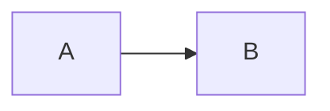

# Code

C++ papers are full of code, and the framework treats code as a first-class citizen. Inline code is C++-highlighted by default, code blocks get the framework's own WG21 C++ grammar and color theme, and a feature called embedded Markdown lets you italicize exposition-only names, write placeholders, and mark individual tokens as added or removed right inside a code block. After reading this file you will be able to write inline code and code blocks in any language, mark code as not proposed, use embedded Markdown with its default and custom delimiters, and turn it on or off exactly where you want it.

## Inline code

Inline code is written in backticks:

````markdown
Use backticks like `int x = 0;` for inline code.
````

Inline code with no language gets C++ highlighting automatically, so `` `int x = 0;` `` is treated as `` `int x = 0;`{.cpp} ``, and a C++ paper does not need `{.cpp}` on every snippet. In PDF and HTML alike, the code prints in a monospace font with C++ keywords, numbers, and operators colored by the framework's theme (described under [Code blocks](#code-blocks)).

A language class in braces right after the closing backtick chooses the highlighting language:

````markdown
`auto value = std::format("{}", bar);`{.cpp}
`let value = format!("{bar}");`{.rust}
`value = f"{bar}"`{.python}
````

Each span is highlighted according to its own language in both outputs.

The `{.default}` class turns off highlighting for one piece of inline code:

````markdown
`int x = 0;`{.default}
````

This prints plain monospace text with no token coloring. It is also the way to show Markdown syntax literally, for example `` `[@N4762]`{.default} ``. Link or citation syntax inside any code span stays literal and does not become a link, but without `{.default}` it would be colored as if it were C++.

To change the inline default for a whole paper, see [Default language for code](10-customization.md#default-language-for-code).

### Combining inline code with other formatting

Code spans in different languages can be placed back to back to build one expression:

````markdown
`3WAY`{.default}`<R>`{.cpp}
````

This renders as one run of code: `3WAY` plain, then `<R>` highlighted as C++.

Inline code also combines with the inline formats from [Headings and formatting](05-headings-and-formatting.md#emphasis-and-underline):

````markdown
==`void foo();`{.cpp}==

~~`A<B<T>>`{.cpp}~~ and ~~`x & y`{.cpp}~~

__foo `constexpr`{.cpp} bar__

_foo `constexpr`{.cpp} bar_

~~foo `constexpr`{.cpp} bar~~

~~_`hello world`_~~
````

Wrapping a whole code span in `==...==` highlights the entire span with a yellow background. Strikeout can wrap a whole code span, including code with angle brackets or ampersands, and the code stays syntax-highlighted inside the strikeout. A highlighted code span can sit inside bold or italic text, a run of prose containing a code span can be struck out, and strikeout and italics can be stacked around the same code span. All of these render the same way in PDF and HTML; in PDF, inline code works inside strikeouts, underlines, and `[...]{.mark}` highlights. The one PDF restriction is the one you already know: do not nest strikeout, underline, and highlighting inside one another.

### Inline code in headings

Inline code in a heading shows as code in the heading and in the HTML table of contents:

````markdown
## Inline Code in Headers: `int`{.cpp}, `x & y`{.cpp}
````

In HTML the code in the heading and its contents entry is syntax-highlighted. In PDF it is plain monospace without highlighting, and the PDF bookmark drops the code formatting entirely.

## Code blocks

A multi-line code block is fenced with three or more backticks:

````markdown
```
int main() {
  return 0;
}
```
````

To show a block that itself contains a ```` ``` ```` fence, use a longer outer fence; the framework's own guide uses six backticks for that, and this guide uses four.

Naming the language right after the opening fence syntax-highlights the block:

````markdown
```cpp
int main() {
  return 0;
}
```
````

Other languages work the same way, such as `bash`, `makefile`, `text`, `yaml`, `diff`, `md`, and `rust`. In PDF the block prints in a shaded box with the tokens colored; in HTML it prints in a shaded box too, and every line of a code block gets its own linkable anchor.

Code blocks are not implicitly C++ the way inline code is, so tag C++ code blocks explicitly with ```` ```cpp ````. A fence with no language shows the code in a shaded code box without syntax coloring. Ordinary markup inside it, such as `[Notes will look like this]{.note}`, shows literally, and blank lines are kept. Such a block can go anywhere in the paper, even before the first heading. To make code blocks C++ by default for a whole paper, see [Default language for code](10-customization.md#default-language-for-code).

### Line numbers

The `.numberLines` class numbers the lines of a code block, and the `startFrom=N` attribute sets the first number:

````markdown
```cpp {.numberLines startFrom=8}
int main() {
  return 0;
}
```
````

The lines of this block are numbered starting at 8. Use `.numberLines` alone when you just want the lines numbered.

Code elements accept these modifier classes: `embed_md`, `raw`, `numberLines`, `lineAnchors`, and `not_proposed`. The sources behind this guide do not describe `lineAnchors` further; the others are covered in this file.

### The C++ grammar and colors

C++ code in every output format is highlighted with the framework's own WG21 "ISO C++" syntax grammar, an upstream KDE definition plus a small WG21 patch, instead of Pandoc's built-in C++ grammar. Paper repositories need no local copy of it. It knows modern C++:

````markdown
```cpp
int x = 42'234'234;
const int y = 42ul;
const int z = 0B01011;
[[using CC: opt(1), debug]] int w;
[[nodiscard]] auto f() -> int;
```
````

Numeric literals are highlighted as numbers, including digit separators (`42'234'234`), suffixes (`42ul`), and binary literals (`0B01011`). C++ attributes are highlighted, including `using` prefixes and arguments, as in `[[using CC: opt(1), debug]]` and `[[nodiscard]]`. Unicode characters are supported in code blocks.

The default WG21 highlighting theme is the same in HTML and PDF:

| Token kind | Color |
|---|---|
| Keywords, control flow, types | teal `#00607c` |
| Strings and numbers | amber `#9f6807` |
| Comments | gray italic `#6a737d` |
| Preprocessor lines | brown `#6f4e37` |
| Operators | purple `#7b3e91` |
| Alerts and errors | red `#ff0000` |
| Code background | light gray `#f6f8fa` |

The colors come from the framework as stylesheet rules for HTML and as matching LaTeX definitions for PDF. HTML readers can switch the colors off with the page's "No syntax highlighting" checkbox, described in [Output and troubleshooting](11-output-and-troubleshooting.md#what-html-readers-get).

## Code that is not proposed

When a paper explores a design it does not propose, the `.not_proposed` class marks the code block so no reader mistakes it for proposed code:

````markdown
```cpp {.not_proposed}
template <typename T>
concept tuple_like = requires {
  typename std::tuple_size<T>::type;
};
```
````

The block keeps its normal highlighting. In HTML it renders with a colored left border, a tinted background, and a "⊘ Not proposed" caption. In PDF it renders with a purple bar down its left side, a pale lavender background, and a bold "⊘ Not proposed" heading.

## Embedded Markdown in code

Embedded Markdown puts Markdown inside code. Text between `@` delimiters is parsed as Markdown and placed back into the code, and the code around the delimiters is untouched. This is how you write italic terms, exposition-only names, wording changes, and stable-name references inside code. Inside code, `@` is real author syntax: it works in plain code blocks and in ```` ```cpp ```` blocks alike.

### Which code gets it by default

Embedded Markdown is on by default for code classed `cpp`, `default`, or `diff`. Unlabeled inline code counts as `cpp`, and unlabeled code blocks count as `default`, so both get embedded Markdown with no setup. The default forms are:

- Inline: `` `code` ``, `` `code`{.cpp} ``, `` `code`{.default} ``, and `` `code`{.diff} ``.
- Blocks: blocks opening with ```` ``` ````, ```` ```cpp ````, ```` ```default ````, or ```` ```diff ````.

Code in any other language, such as `` `code`{.rust} `` or a ```` ```yaml ```` block, gets no embedded Markdown unless you opt in; there, `@...@` text shows literally. [Turning embedded Markdown on for other languages](#turning-embedded-markdown-on-for-other-languages) shows how to opt in, and [Which code gets embedded Markdown](10-customization.md#which-code-gets-embedded-markdown) shows how to change the list for a whole paper. Embedded Markdown in a C++ block needs no extra attributes and keeps normal C++ highlighting for the surrounding code. A block marked `.not_proposed` keeps its embedded Markdown too.

### Italic terms and placeholders

Wrapping a term as `@*...*@` italicizes it inside code:

````markdown
Recall the `static_cast` syntax: `static_cast < @*type-id*@ > ( @*expression*@ )`.
````

`type-id` and `expression` print in italics inside the highlighted code, in both PDF and HTML.

Because italic terms are so common, `$text$` inside code is a shorthand for `@*text*@`:

````markdown
`static_cast < $type-id$ > ( $expression$ )`
````

This renders exactly like the previous example, and the `$` markers disappear from the output. Hyphenated names work, which makes this the usual way to write exposition-only names and placeholders such as `$unspecified$`:

````markdown
```cpp
namespace $unspecified$ { struct sender_base {}; }

template <class F>
struct $as-receiver$ {
  F f_;
};
```
````

`unspecified` and `as-receiver` print in italics while `namespace`, `struct`, and the braces keep their C++ colors.

A few more forms are useful:

- `$~i~$` gives an italic subscripted index, as in `x$~i~$ <=> y$~i~$;`, and `$pp-tokens~opt~$` gives an italic name with an "opt" subscript.
- Italic subscripts also work inside inline code, as in `` `constexpr$~opt~$`{.cpp} `` and `` `x$~i~$ <=> y$~i~$`{.cpp} ``.
- An identifier that begins with an underscore can be italicized with its underscore kept, as in `int $_0$;`.
- An italicized name can sit directly before a brace without the brace being read as attribute syntax, as in `auto interp = $Template${get_result()};`.
- Fragments can sit flush against code tokens, as in `constexpr$~opt~$`, without losing keyword highlighting or gaining stray spaces.

A lone `$` in code stays a literal dollar sign, and a lone `@` in inline code stays a literal character, as in `` `operator@`{.default} `` and `` `x @ y`{.default} ``. It takes a matching pair to start a fragment.

### Math and highlighting inside code

Typeset math can be embedded in a code block with `@$...$@`:

````markdown
```
@$\frac{a+b}{2}$@  // math
```
````

The fraction is typeset as math, followed by the plain `// math` comment. In HTML it is MathML; in PDF it is typeset by LaTeX.

`==...==` inside an escape highlights one part of the code with a yellow marker, while the rest of the code stays highlighted:

````markdown
`void @==foo==@();`{.cpp}
````

Only `foo` gets the yellow background; `void` and `();` keep their C++ colors. The same works in code blocks, and even around a literal dollar sign, as in `@==$==@text@==$==@`.

### How fragments are parsed

Embedded Markdown parsing is deliberately simple, and knowing its rules saves surprises:

- Each embedded fragment must open and close on the same line. A delimiter with no matching close before the end of the line stays in the code as literal text.
- Everything between `@` delimiters is parsed as Markdown, so C++ punctuation such as the `*` in pointer declarations can turn into emphasis. [Keeping C++ symbols literal inside a change](#keeping-c-symbols-literal-inside-a-change) shows the problem and how to avoid it.
- For the same reason, `@` characters in ordinary C++ code, such as email addresses in string literals, silently disappear unless the code is marked `.raw`, because the text between two `@` is parsed as Markdown. [Turning embedded Markdown off](#turning-embedded-markdown-off) shows the fix.
- Inside embedded fragments, raw HTML and smart punctuation are off, so `<T>` in `foo<T>` is not read as an HTML tag and `...` is not turned into an ellipsis.
- Fragments are parsed with the paper's own Markdown dialect.
- Code annotations made with embedded Markdown do not break the surrounding syntax highlighting.
- In PDF, embedded Markdown is not applied to inline code inside a heading; HTML output does process it.

The framework's code-formatting defaults apply to practically all code in a paper, including inline code, code blocks with embedded Markdown, and the fragments inside them.

## Wording changes inside code

The most common use of embedded Markdown is showing exactly which tokens of a declaration change. Three pieces of wording-change markup do that. Each is a bracketed span with a class: `[text]{.add}` marks added text, `[text]{.rm}` marks removed text, and `[old](new){.sub}` marks a substitution of new text for old. [Adding and removing text](07-wording.md#adding-and-removing-text) covers them fully for prose; here is how they behave inside code.

### Marking tokens as added or removed

Wrap each change in `@` delimiters around the exact tokens that change:

````markdown
```
  constexpr @[typename]{.rm}@ tuple_element@[_t]{.add}@<I, pair<T1, T2>>@[::type]{.rm}@&
```
````

Inside code, `[text]{.rm}` between `@` delimiters shows as red struck-out text, and `[text]{.add}` shows as green underlined text; the text inside an add span is not syntax-highlighted. `[old](new){.sub}` shows the old text struck out followed by the new text inserted, and several escapes can share one line, as here. In HTML, readers can hide the struck-out text with the page's "Hide deleted text" checkbox.

When showing inline edits in a code block, leave the language off the fence (plain ```` ``` ````) so syntax highlighting does not compete with the add and remove colors.

Changes can be mixed with `$...$` italic terms in one block:

````markdown
```
template <@[invocable](class){.sub}@ F@[, class]{.add}@>
struct $as-receiver$ {
@[private:]{.rm}@
```
````

`invocable` is struck out and replaced by `class`, `, class` is inserted, `as-receiver` is italic, and `private:` is struck out.

A whole line of code can be struck out while keeping its indentation, by wrapping the line content in a removal escape:

````markdown
```
  @[using invocable_type = std::remove_cvref_t<F>;]{.rm}@
```
````

A fragment can be inserted in the middle of a line of highlighted code without breaking highlighting for the rest of that line. Putting inline code inside the escape shows the inserted fragment as code rather than prose:

````markdown
```cpp
void set_value() @[`noexcept(is_nothrow_invocable_v<F&>)`]{.add}@ {
```
````

The `noexcept` clause is shown as added code, and `void set_value()` and the brace keep their C++ colors.

Inline code works the same way. An `@...@` pair inside an inline code span drops back into Markdown:

````markdown
`@[hello<T>]{.add}@`
````

This marks the code as added, with the add styling inside the code.

### Prose formatting inside a change

Ordinary Markdown inside an escape formats the wrapped text as prose rather than code:

````markdown
```
@[namespace _unspecified_ { struct sender_base {}; }]{.add}@
```
````

`_unspecified_` becomes italic, but the wrapped text is shown as prose, not code, so it loses C++ coloring. That is often exactly what you want for new wording in a plain block.

### Keeping C++ symbols literal inside a change

Because everything inside an escape is Markdown, C++ punctuation can be eaten. `void f(@[int i]{.add}@);` is fine, but `void f(@[*Widget* *const *ptr]{.add}@);` loses its pointers and italicizes `const`. There are three fixes.

A backslash keeps a Markdown character literal inside embedded Markdown:

````markdown
```
void f(@[*Widget* \*const \*ptr]{.add}@);
void f(@[**Widget** \*const \*ptr]{.add}@);
void f(@[int \*const \*_p~i~_]{.add}@);
```
````

The first line italicizes `Widget` and keeps both asterisks; the second bolds `Widget` instead; the third keeps the asterisks and gives an italic subscripted `p`. An escaped space `\ ` keeps a trailing space inside an escape, as in `@[constexpr\ ]{.rm}@`, so a deleted keyword keeps its separating space.

Nesting inline code inside the `@` span keeps C++ symbols literal while `$...$` still italicizes:

````markdown
```
void f(@[`$Widget$ *const *ptr`]{.add}@);
@[``$baz$``]{.add}@  // italicized code
@[`$bar$`{.raw}]{.add}@  // raw $bar$
```
````

The first line shows the whole parameter as added code with `Widget` italic and the asterisks intact. Double backticks inside an escape work the same as single ones. Adding `{.raw}` to the nested inline code keeps `$...$` literal, so the third line shows `$bar$` with its dollar signs in the added code, while the `$bar$` in the trailing comment, outside the raw code, still becomes italic. This nesting approach handles only simple italic markup.

Doubling the delimiter, `@@...@@`, embeds a fragment that itself contains the single delimiter, such as inline code with its own embedded Markdown:

````markdown
```cpp
@@[`namespace @_unspecified_@ { struct sender_base {}; }`]{.add}@@
```
````

The whole line is added code with `unspecified` in italics, the same result as the `$unspecified$` form.

### Exposition-only names in changed code

Hyphenated exposition-only names and trailing "exposition only" comments can be italicized, several on one line, in any of the three embed forms:

````markdown
```
@[template<class, class> struct _as-receiver_; _// exposition only_]{.add}@
@[`template<class, class> struct $as-receiver$; $// exposition only$`]{.add}@
@@[`template<class, class> struct @_as-receiver_@; @_// exposition only_@`]{.add}@@
```
````

All three lines show an added declaration with `as-receiver` and the comment in italics. The first formats the line as prose; the second and third keep it as code.

A whole line of code with several italicized names can be struck out the same way:

````markdown
```
@@[`@_as-receiver_@(@_as-receiver_@&& other) = default;`]{.rm}@@
```
````

The line is struck out in red with both `as-receiver` names italic.

### Stable names in code comments

A stable-name reference works inside a code comment. An explicit stable name, written `[name]{.sref}`, links to that section of the C++ working draft and spells out its section number and title; [Explicit stable names](09-stable-names-and-citations.md#explicit-stable-names) explains it fully.

````markdown
`string format(...);  // @[format.functions]{.sref}@`
````

The comment renders as "// 28.5.5 Formatting functions [format.functions]", with `[format.functions]` as a link to the draft. The paper's other inline markup works inside embedded fragments too: `.add`, `.rm`, and `.sub` spans and `.sref` references all work inside `@...@`, and so do the note spans and `diff` coloring covered in [Wording](07-wording.md). Without the `@` delimiters, stable-name syntax inside inline code stays literal, which is how to show `` `[basic.life]{.sref}` `` as source.

Whole-block diffs with `-` and `+` line markers use the `diff` class, which [Code changes](07-wording.md#code-changes) covers.

## Turning embedded Markdown off

The `.raw` class turns embedded Markdown off for a `cpp`, `default`, or `diff` block, so `@` and `$` print exactly as typed:

````markdown
```cpp {.raw}
auto emails = { "a@mail.com", "b@mail.com" };
```
````

With `.raw`, both email addresses print intact, with full C++ highlighting. Without it, the text between the two `@` characters would be parsed as Markdown and the `@` characters would disappear.

`.raw` can be stacked with other classes on inline code to show `$` and `@` literally:

````markdown
`$Widget$ *const *ptr`{.default .raw}
````

This prints `$Widget$ *const *ptr` exactly as typed, in plain monospace.

`.raw` turns off the default `@` and `$` delimiters on one code element even when its language gets embedded Markdown by default.

## Turning embedded Markdown on for other languages

The `.embed_md` class opts a code span or block into embedded Markdown. Text between `@...@` is parsed as Markdown, and text between `$...$` becomes an italic fragment. For a code block in another language, add `.embed_md` after the language:

````markdown
```rust
fn main() {
    @**println**@!("hello!");
}
```

```rust {.embed_md}
fn main() {
    @**println**@!("hello!");
}
```
````

The first block leaves `@**println**@` literal. The second renders `println` in bold, with the rest of the line highlighted as Rust. The framework's own guide uses ```` ```makefile {.embed_md} ```` and ```` ```yaml {.embed_md} ```` the same way.

For inline code in another language, add `.embed_md` next to the language class:

````markdown
`s.trim_@[left](start){.sub}@()`{.rust}

`s.trim_@[left](start){.sub}@()`{.rust .embed_md}
````

The first keeps the markup literal; the second renders the substitution, with `left` struck out and `start` inserted.

A code block can also be opted in with the all-in-braces fence form, which combines classes and attributes:

````markdown
```{.default .embed_md md="%" em="!"}
%[`!custom!`]{.add}%
```
````

Here `.default` names the no-language style, and the `md` and `em` attributes, explained next, pick `%` and `!` as the delimiters, so `%[...]{.add}%` is an embedded fragment that shows its inline code as added. `.embed_md` is shorthand for `md=@ em=$`.

Code in NASM, Rust, or any language outside `cpp`, `default`, and `diff` gets embedded Markdown only with `.embed_md`, with `md` or `em` attributes, or through a custom `embedded-md-code-classes` list for the whole paper, described in [Which code gets embedded Markdown](10-customization.md#which-code-gets-embedded-markdown).

## Changing the delimiters

Two attributes change the delimiters on one code element:

- `md=<symbol>` changes the embedded-Markdown delimiter from its default `@`, and `md=none` disables it.
- `em=<symbol>` changes the italics delimiter from its default `$`, and `em=none` disables it.

The `md` and `em` attributes accept any delimiters, for example `{.cpp md="%" em="^"}`, and a delimiter may be more than one character. Setting either attribute on a code element enables embedded Markdown for it without `.embed_md`, and the attributes still take effect on an element marked `.raw`.

### Code full of @ and $

For code full of `@` and `$`, such as bash, choose a different Markdown delimiter and disable the italics one:

````markdown
```bash {md=% em=none}
rsync -av %**"$@"**% "deploy@$target:/srv/app/"
```
````

Only `"$@"` is bolded. The `@` and `$` characters elsewhere in the line print as typed, because `@` is no longer a delimiter and `$` italics are off.

The same idea works on inline code. `{.default md=%}` lets `%...%` act as the delimiter when the code itself contains `@`. `em=none` works on inline code as well as code blocks, as in `` `...`{.default em=none} ``, and combines with a swapped Markdown delimiter, as in `` `...`{.default md=% em=none} ``.

### Italics only

On code whose language does not get embedded Markdown by default, setting `em` alone turns on the italics shorthand without turning on `@` embeds, and a fence can combine a language with braces:

````markdown
```yaml {em="!"}
@[not embedded]{.add}@ and !emphasized!
```
````

`!emphasized!` becomes italic, while `@[not embedded]{.add}@` shows literally with YAML highlighting. Likewise `md="none"` on `cpp`, `default`, or `diff` code keeps only the `$...$` shorthand, and `em="none"` keeps `@...@` Markdown while leaving `$` literal.

### Delimiters and nested code

A block's own delimiter settings do not apply to inline code nested inside an embed. In the all-in-braces example above, with `md="%"` and `em="!"`, the fragment ``%[`!custom!`]{.add}%`` shows `!custom!` literally inside the added inline code, because the block's `em="!"` does not reach that nested code.

For anything between full embedding and none, remember the two shorthands: `.embed_md` is `md=@ em=$`, and `.raw` is `md=none em=none`. Use the explicit `md` and `em` form for anything else.

## Diagrams and other blocks

The framework has no diagram renderer. A ```` ```mermaid ```` block passes through untouched:

````markdown

````

In HTML it stays as plain source in a `<pre class="mermaid">` element, without the usual code styling or line anchors. In PDF it shows the source text as a plain code block. Rendering it into a diagram is left to an external filter or script you add yourself; [Stylesheets and filters](10-customization.md#stylesheets-and-filters) says how far the sources go on adding one.

Previous: [Headings and formatting](05-headings-and-formatting.md) | Next: [Wording](07-wording.md)

*2026-09-25 - claude-opus-5.5*
