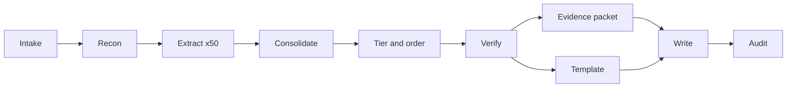

# Dokuman run: MPark/WG21 user guide

## Target and scope

- Target: [wg21/](wg21/), the Pandoc-based framework that turns WG21 papers written in Markdown into PDF (through xelatex), HTML, and LaTeX, driven by `make`.
- The guide is for paper authors. It covers:
  - the extended syntax: metadata, headings, inline formatting, code, embedded Markdown, wording, paragraph numbers, notes and examples, grammar, comparison tables, stable names, and citations
  - the command line, meaning every `make` target (`<paper>.pdf|html|latex`, `all`, `pdf`, `html`, `latex`, `serve`, `clean`, `update`, `distclean`, `check`) and every variable (`OUTDIR`, `DEFAULT_FORMAT`, `DEFAULTS`, `REQUIREMENTS`, `PAPER_RULE`, `SERVE_HOST`, `SERVE_PORT`)
  - observable behavior: dependency bootstrapping, auto-detection of `defaults.yaml` and `requirements.txt`, files skipped by `make` (`CHANGELOG.md`, `LICENSE.md`, `README.md`), warnings, error suggestions, and the deprecated-include warning.
- Excluded: Python function and class names, filter internals, and any public API description.
- Formats: PDF is the headline. HTML is covered fully, including the sidebar table of contents, the light/dark theme switch, and live reload, with the differences from PDF called out.
- Windows: one clearly marked note that the upstream docs only cover macOS, Ubuntu, and Debian, and that WSL is the likely route. Nothing further on Windows.
- Output: a multi-file Markdown guide in `wg21/dokuman/` (the folder doesn't exist yet, so nothing gets overwritten). You asked for this location, so it replaces the usual cabinet output folder. The files are left untracked in the wg21 git clone and are not committed. Scratch still goes to `cabinet/_scratch/dokuman-wg21/`. Each file ends with an italic footer giving date, time, and model.

## Overrides to Dokuman defaults (from your instructions)

- Tier coverage: tiers 1 and 2 are covered completely. Tier 3 is also covered completely for syntax, commands and variables, metadata keys, and anything a user can observe. Tier 3 internals are dropped.
- Length: no overall cap, and a read of 30 to 45 minutes is expected. The 500 to 700 word rule applies to each sub-feature, so a long feature gets split into several sections rather than trimmed.
- Tier task: allow up to 16 sections instead of 12.
- Verify task: raise the cap to 500 tokens and add a fifth check, completeness, which covers three things:
  - every heading in [wg21/MANUAL.md](wg21/MANUAL.md)
  - every test case in `wg21/tests/*.md`
  - every target and variable in [wg21/flat.mk](wg21/flat.mk), [wg21/paper.mk](wg21/paper.mk), and [wg21/base.mk](wg21/base.mk).
- Evidence packet: tier-3 items in the three covered areas are never dropped. The usual "if in doubt, omit" rule applies only to internals.
- Writer: one author writes every file, one file per write, which also keeps each write small enough to avoid timeouts. Files link to each other with relative links such as `[paragraph numbers](07-wording.md#paragraph-numbers)`, and a file never relies on a concept that an earlier file in the reading order hasn't introduced. Each syntax example shows the Markdown source first, then describes how it renders in PDF and in HTML. Code fences use four backticks, because many examples contain three-backtick fences. The no-em-dash and no-double-dash rule applies to prose only; literal syntax such as `{- .unlisted}` stays verbatim.
- Models: every subagent uses the default model. The tool asks for a "fast model" for recon and dedup, but that needs a model you name.

## Pipeline

1. **Recon** (one subagent): writes the structural brief and the extraction manifest. What the manifest should contain:
   - Include:
     - documentation: README, CHANGELOG, and MANUAL.md
     - build files: the four `.mk` and Makefile files, plus `deps/*`
     - `data/defaults/*.yaml` and `data/metadata.yaml`
     - `data/filters/wg21.py` and `data/filters/citetitle.py`
     - the helper scripts: `refs.py`, `srefs*.py`, `suggest-target.py`, `toc-depth.py`, `serve.py`
     - the templates `wg21.html`, `wg21.latex`, `view-controls.html`, `toc.js`, `theme.js`
     - every `tests/**/*.md` file and every test Makefile.
   - Split the largest files into line ranges:
     - MANUAL.md into four entries, roughly lines 1-526, 527-949, 950-1442, and 1443 to the end
     - `wg21.py` into two entries.
   - Exclude:
     - expected outputs, `.patch` files, CSL files, syntax XML, and CSS
     - the default templates, `render.py` (it only builds the manual), `.github`, and LICENSE
     - `wg21/dokuman/` itself, so a later run doesn't extract from the guide.
   - Expected size: about 50 entries.
2. **Extract** (one subagent per manifest entry, about 10 at a time): each one frames what it finds as syntax the author writes, commands the author runs, or output the author sees. For test files, it pulls out the exact source syntax being exercised.
3. **Consolidate** (main): concatenate the extraction files with the shell. The list will be well over 80 items, so one subagent removes duplicates, keeping both items whenever in doubt.
4. **Tier and order** (one subagent): applies the section-count override above.
5. **Verify** (one subagent): applies the added completeness check. Main applies its corrections as targeted edits, finding each item by its number, without reading the whole file.
6. **Evidence packet** (one subagent), **run in parallel with** the report template (main, working only from the short SECTIONS list at the end of the tiered file).
7. **Write** (one subagent, single author): follows the file layout below. Drafts go to `cabinet/_scratch/dokuman-wg21/draft/`, one file per guide file.
8. **Audit** (main): works through the draft one file at a time. For each file:
   - Check every example, first against the evidence details file, then against the source files, then against `wg21/tests/expected/*.html|latex` for how things actually render. That last check is needed because nothing on this machine can build papers (no make, pandoc, or xelatex).
   - Fix any invented flags or metadata keys.
   - Confirm every relative link points to a real file and heading.
   - Check the style rules.

   Then write the corrected files to `wg21/dokuman/`.

## File layout (The Tour, split into files)

The report template becomes a file map. Main writes it as one scratch file listing each guide file, its headings, and a one-line instruction for each heading. The filenames are numbered in reading order:

- `README.md`: the opening hook, a short orientation to the core features, and a table of contents that links to every file with one line on what each covers
- `01-getting-started.md`: requirements, the Windows note, adding the framework as a submodule, and the first build
- `02-project-layouts.md`: flat and per-paper layouts, `PAPER_RULE`, and the shared `config.mk` and `local.mk` conventions
- `03-building.md`: the full reference for commands and variables, the live server, `update`, `distclean`, and what the first build downloads
- `04-paper-metadata.md`: every key in the YAML front matter
- `05-headings-and-formatting.md`: headings, references to sections, and inline formatting
- `06-code.md`: inline code, code blocks, `.not_proposed`, and embedded Markdown with all of its controls
- `07-wording.md`: adding and removing text, paragraph numbers, list-based paragraphs, notes, examples, grammar, and code changes
- `08-comparison-tables.md`: comparison tables
- `09-stable-names-and-citations.md`: stable names, citations, and references
- `10-customization.md`: `defaults.yaml`, `requirements.txt`, extra keywords, embedded-Markdown code classes, `number-srefs`, and Unicode fonts
- `11-output-and-troubleshooting.md`: what readers see in HTML compared with PDF, plus warnings and error messages
- `12-quick-reference.md`: a one-page cheat sheet of syntax, targets, and variables, where each entry links back to its full explanation

## Pipeline check (data flow)

- Each step gets everything it needs from earlier steps:
  - the manifest feeds step 2
  - the brief feeds step 6
  - the per-file notes feed step 3, and the master list feeds step 4
  - the tiered list feeds steps 5 and 6
  - the packet and details feed step 7, and the details also feed step 8.
- Two changes make it more efficient:
  - The template only needs the SECTIONS list, so it runs alongside step 6 instead of after it.
  - Main applies verify's corrections by grepping for item numbers, not by reading the whole file.
- Dedup could be folded into tiering, but with several hundred items a separate pass keeps the tiering subagent focused. It stays separate.
- The main risk is the length of step 7. Writing one file at a time reduces it. If the writer stalls, a fresh writer picks up at the first missing file, reading the finished drafts first to match their voice.
- Auditing one file at a time keeps the main context small, since the whole guide never has to be loaded at once.
